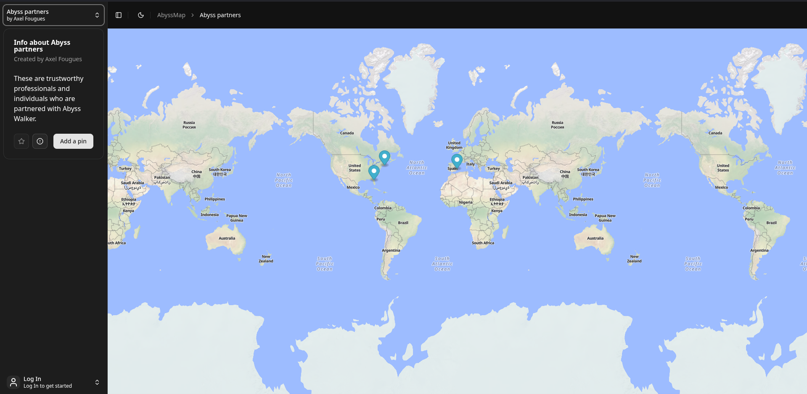

# Thingmap

Thingmap is a webapp designed to make it easy for you and your community to colaboratively maintain a map of whatever thing you may want to maintain a map of.

See a live deployment at [Abyss Walker](https://map.abysswalker.org/)

Features:

- Maps

- Points
  
  - With name, description and url

- Accounts (and management)
  
  - SSO with GitHub support

- Favourites

- Suggestions

- Issues

- Map and Pin/Point management

openfreemap and MapLibreGLS are being used for the map components itself.

## Getting Started

This is a fullstack NextJS project designed to be deployed on vercel, however nothing would stop you from deploying anywhere else and changing the database location.

Create the required environment variables and run `vercel --prod` to deploy. Dont forget to connect a Neon DB and run `bunx drizzle-kit push` to apply the schema.

For development, set the required env vars and run `bun install` followed by `bun run dev`.